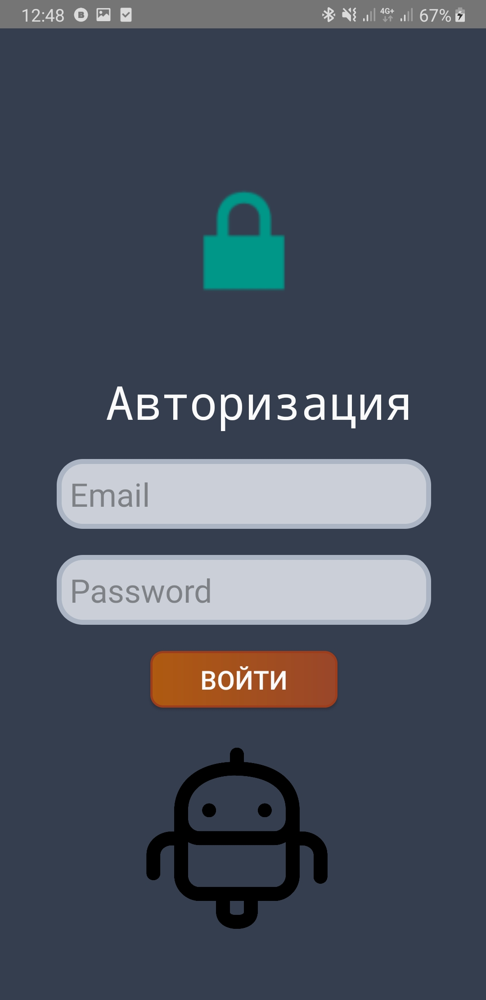
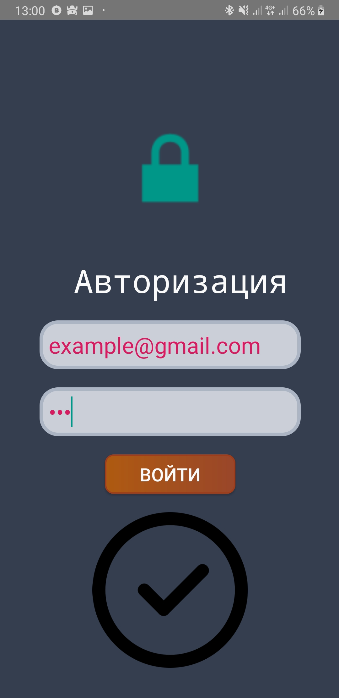
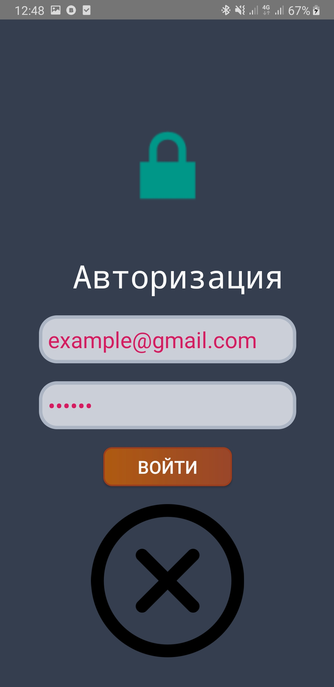

# Email-and-Password-Screen
**This App is the sign in screen**
=====
First you can see this screen 
If you enter correct email and password(example@gmail.com 123) picture will changed 
else picture will changed to 

This is first app where I made design for button, Email and password
I made it with [video course](https://itproger.com/course/java-android/8)
